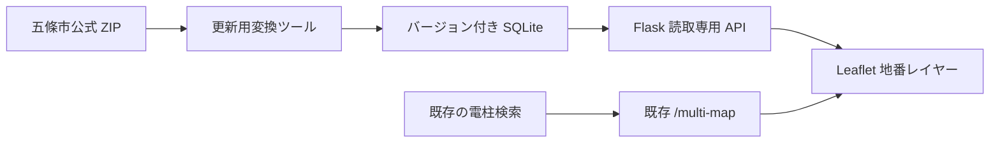

# LINE Bot 地番参考図オーバーレイ設計

更新日: 2026-07-29

## 1. 結論

LINE Bot の既存検索・電柱座標解決・返信形式は変更せず、地図ページに五條市の
地番参考図を追加レイヤーとして重ねる。

データ源は夜間停止することがある「ゴーカスターナビ」の画面や内部 API ではなく、
五條市が CC BY 4.0 で公開している公式シェープファイルを使う。

初回の対象は径間検索後に開く 2 点地図 (`/multi-map?p1=...&p2=...`) とする。
周辺 200 m 地図 (`/map`) と複数行地図への展開は、初回運用確認後に同じ仕組みを
流用する。

## 2. 現状

- 本番起動経路は `Procfile` の `gunicorn app:app`。
- LINE Webhook は `app.py` の `/callback`。
- 単独地点・現在地は `/map`、径間と複数地点は `/multi-map`。
- 径間検索は若番・老番を解決し、2 点を URL パラメータで `/multi-map` に渡す。
- 地図は Leaflet 1.9.4 と OpenStreetMap を使用している。
- 2 点地図は Redis を使わないため、地番表示を加えても DB スキーマ変更は不要。
- `server.js` と `README.txt` は古い Node 系の説明を含む。今回の実装対象にしない。

## 3. 公式データ

五條市の公開データ（令和 8 年 1 月 1 日時点）:

| データ | 概要 | 確認した件数 |
|---|---|---:|
| 地番 | 地番ラベルの点 | 106,525 |
| 地番引出線 | 小筆等のラベル引出線 | 10,735 |
| 筆ポリゴン | 筆界の参考形状 | 113,505 |
| 大字名 | 大字ラベル | 3,438 |
| 大字界 | 大字境界 | 344 |

座標系は JGD2000 / Japan Plane Rectangular CS VI（EPSG:2448）。
Web 地図用に WGS84（EPSG:4326）へ変換する。
DBF の日本語は CP932 として正常に読めることを確認した。

筆ポリゴンは公開 ZIP が 2 分割されており、片方に `.shp`、もう片方に
`.dbf`、`.shx`、`.prj` がある。変換時に同じ作業ディレクトリへ揃えてから読む。

地番参考図は測量成果・公図ではなく、正確な筆界、権利関係、申請資料には使えない。
画面上にも「参考図」である旨を常時表示する。

## 4. 採用構成

### 4.1 更新用変換ツール

本番アプリとは分離した保守用ツールにする。

1. 公式 URL から ZIP を取得する。
2. SHA-256、取得日時、公開基準日、URL、利用規約 URL を manifest に記録する。
3. 筆ポリゴンの分割ファイルを揃える。
4. EPSG:2448 から EPSG:4326 へ変換する。
5. 筆ポリゴンの `VISIBLE=0`（実データ 7,978 件）を除外し、
   `VISIBLE=1`（105,527 件）を表示対象にする。
6. Web 表示に不要な DBF 列を捨てる。
7. 筆、地番点、引出線、大字界を SQLite に格納する。
8. RTree 空間インデックスを作る。
9. 件数、範囲、文字化け、既知地点を検証してから成果物を確定する。

変換時だけ GDAL/GeoPandas 等を使用してよい。本番 `requirements.txt` には入れず、
LINE Webhook の起動時間・配布容量・障害面積を増やさない。

### 4.2 SQLite

本番では標準の `sqlite3` で読み取り専用に開く。

想定テーブル:

- `parcel_geometries`: 筆ポリゴンと bbox
- `parcel_labels`: 地番文字、表示位置、角度、bbox
- `leader_lines`: 地番引出線と bbox
- `oaza_boundaries`: 大字界
- `dataset_manifest`: 出典、版、変換日時、ハッシュ

地図全域をブラウザへ送らず、表示範囲に交差する要素だけ RTree で返す。

### 4.3 Flask API

新設候補:

`GET /api/cadastral/features?bbox=west,south,east,north&zoom=18`

応答:

- `FeatureCollection` 形式
- zoom 17 未満は原則空
- zoom 17 は筆界中心
- zoom 18 以上で地番ラベル
- zoom 19 以上で引出線
- 最大件数と最大 bbox 面積を制限
- データ未配置、範囲外、内部失敗時は地番だけ非表示にし、HTTP 地図自体は壊さない

API は公開情報のみを返し、認証情報や LINE ユーザー情報を扱わない。

### 4.4 Leaflet

既存 `templates/multi_map.html` の Leaflet を維持する。

- OSM 背景地図
- 地番参考図 pane
- 電柱マーカー・径間ラベル

の順に重ね、電柱を常に最前面にする。

画面移動後 200-300 ms の debounce を置き、その時点の bbox だけ取得する。
前回リクエストは中断し、古い応答で画面を上書きしない。

UI:

- `地番図 ON/OFF`
- 読込中表示
- `地番参考図（五條市）/ 境界・権利関係の確認には使用不可`
- 出典と CC BY 4.0 のリンク
- 範囲外は `五條市地番図の範囲外`
- 取得失敗時は `地番図を表示できません` とだけ表示し、通常地図は継続

初回リリースは既定 OFF とし、操作者が ON にした場合だけ取得する。
安定後に五條市内だけ既定 ON を検討する。

## 5. データ配布

大容量成果物は Git 履歴へ直接積み増さない。

推奨:

1. 変換済み SQLite をバージョン付き GitHub Release asset として保管する。
2. Render build 時に固定バージョンと SHA-256 を指定して取得する。
3. ハッシュ不一致なら地番機能だけ無効化し、Bot 本体は起動させる。
4. 起動時に manifest をログへ 1 行だけ出す。

環境変数候補:

- `CADASTRAL_LAYER_ENABLED=0`
- `CADASTRAL_DATA_PATH=...`
- `CADASTRAL_DATA_VERSION=2026-01-01`
- `CADASTRAL_DATA_SHA256=...`

秘密値は不要。公式 ZIP の URL や閲覧サイト内部 URLを実行時に参照しない。

## 6. 適用範囲

### 第 1 段階

- 2 点径間地図だけ
- 隠しクエリまたは運用者限定で有効化
- 地番レイヤーは既定 OFF

### 第 2 段階

- 五條市内で一般利用
- `/map` の周辺 200 m 地図にも追加
- 複数行検索の地図にも追加

### 対象外

- 十津川村・吉野町の地番データを推測して表示しない
- 地番から地主を推測・表示しない
- 地番参考図を権利確認や申請資料に使わない
- ゴーカスターナビの画面、タイル、内部 API を無断で中継しない
- 検索名の正規化、若番・老番解決、電柱座標データを変更しない

## 7. 障害時の原則

地番図は補助レイヤーであり、失敗しても次を維持する。

- LINE の返信
- 検索結果
- 2 点の電柱マーカー
- Google Maps リンク
- OSM 背景地図
- `/healthz`

地番 SQLite が無い、壊れている、API が失敗する、ブラウザが古い、データ範囲外の
いずれでも通常地図へ自動フォールバックする。

## 8. テスト

### 変換データ

- 公式件数と変換後件数の差分を記録
- bbox が五條市付近にある
- 日本語地番が文字化けしていない
- 既知の 5 地点で筆と地番が得られる
- `VISIBLE` の扱いを実データで確認
- 出典、基準日、SHA-256 が manifest にある

### API

- 正常 bbox
- 五條市外
- zoom 不足
- bbox 過大
- 不正パラメータ
- データファイル無し
- 同時アクセスと read-only SQLite
- 応答サイズ上限

### 画面

- スマートフォン幅
- 2 点が近い径間と遠い径間
- 地番 ON/OFF
- 地番取得失敗中もマーカーが残る
- 電柱ラベルが地番より前面
- 出典と注意書き
- 地図移動時に古い応答が混ざらない

### 回帰

- 単一電柱検索
- 径間検索
- 複数行検索
- 緯度経度検索
- Google Maps リンク
- Redis 有無
- `/healthz`

## 9. 導入手順

1. 現行本番 URL と検索結果を記録する。
2. 変換ツールと fixture だけ作る。
3. SQLite と API のローカル検証を行う。
4. 地番機能 OFF のままデプロイし、既存機能を確認する。
5. 運用者限定で ON にする。
6. 既知径間を現地感覚と照合する。
7. 問題がなければ 2 点径間地図へ公開する。
8. `/map` と複数行地図への展開は別変更として行う。

ロールバックは `CADASTRAL_LAYER_ENABLED=0` のみで成立させる。

## 10. 実装前ゲート

次の確認が揃うまでは実装・公開しない。

- 本番が Python `app.py` / `/callback` で動いていること
- Render の実際の build/start 設定
- GitHub Release asset を Render から取得できること
- 五條市利用規約の最新内容
- 出典文言
- 既知径間 5 件の期待表示
- 地番図を初期 OFF にする運用合意

## 11. 既存の別課題

今回の地番図とは分けて扱う。

- `README.txt` が Node 版と `/webhook` を案内しており、現行 Python 版とずれている。
- `server.js` が残っており、将来の保守対象を誤認しやすい。
- 自動テストが見当たらない。
- アクセス制御の一時復旧コードは、地番図変更と同時に触らず別途監査する。

## 12. 実装結果（2026-07-29）

実装済み:

- `tools/build_gojo_cadastral_db.py`
  - 公式ZIPの取得
  - CP932のZIP内ファイル名とDBF文字列の処理
  - EPSG:2448からEPSG:4326への変換
  - `VISIBLE=0`の筆を除外
  - RTree付きSQLite生成
  - 出典、基準日、URL、SHA-256、件数、表示範囲をmanifestへ保存
- `cadastral_service.py`
  - SQLiteを`mode=ro&immutable=1`で開く
  - bboxとzoomの制限
  - 表示範囲内の筆、地番、引出線だけ取得
  - 五條市外の範囲判定
- `/api/cadastral/features`
  - 機能OFF時は404
  - データ欠損時は503
  - 正常時はGeoJSON
- `/healthz/cadastral`
  - 有効状態、データ有無、基準日、ライセンスだけを返す
  - ファイルパスや秘密値は返さない
- 2点地図
  - 地番図ON/OFF
  - 初期OFF
  - 250ms debounce
  - 前回通信の中断
  - 電柱マーカーを前面に維持
  - 出典と参考図の注意書き
  - API障害時も通常地図を維持

実データ成果:

- SQLite: 74,014,720 bytes
- SHA-256:
  `0597d9af5250237d21765c105b488a8b3090311171b2a66b71326116b702fa71`
- 筆: 105,527件
- 地番: 106,525件
- 引出線: 10,735件
- 大字界: 344件
- 木ノ原40E1S3〜40E1S4周辺、zoom 18:
  筆425件、地番391件、合計816件
- 同範囲のSQLite照会:
  中央値8.3ms、最大47.2ms（20回）

検証:

- Python compile
- unit/route/fetch tests（12件）
- 実SQLiteのintegrity、件数、既知範囲
- スマートフォン幅412pxのブラウザ表示
- 地番APIを503にした障害試験
- 既存の木ノ原40E1S3〜40E1S4検索と2点URL

## 13. ロールバック

実装前HEAD:

`d1521c7c5dd7fe5086c2b4d319703c8306c0eb36`

ローカル退避ブランチ:

`backup/pre-cadastral-overlay-20260729`

復帰は次の順で行う。

1. 即時停止:
   `CADASTRAL_LAYER_ENABLED=0`
2. データだけ停止:
   SQLiteを配布対象から外し、フラグをOFFにする
3. コード復帰:
   地番実装を含むコミットを`git revert`する
4. 比較確認:
   退避ブランチと現在の差分を確認する

機能フラグOFFでは、地番ボタン、地番API呼び出し、SQLite読込は通常地図の利用経路に
入らない。データ取得失敗時もBot本体を停止させない。

## 14. 公開前に残る作業

- 生成済みSQLiteをGitHub Release等へ配置する
- Renderのbuild工程へSHA-256付き取得処理を追加する
- 地番機能OFFのまま先にデプロイして既存検索を確認する
- 運用者限定でONにしてLINE実機確認する
- 問題がなければ一般利用へ切り替える
